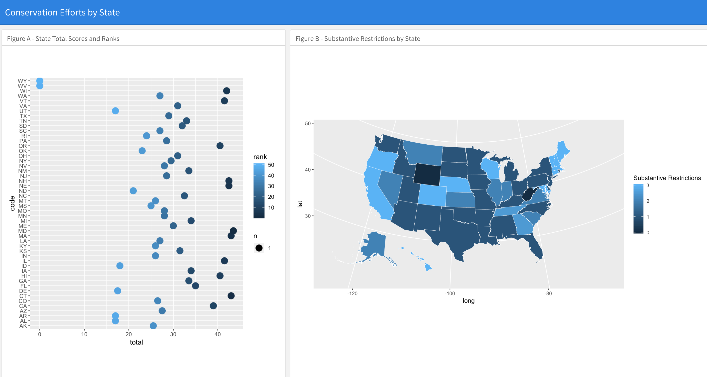

# State Endangered Species 

This application gives a brief overview of conservation efforts in every state in the U.S.

It contains two visualizations of states' conservation efforts.

In the first, we see a clear depiction of states stack up against one another in terms of conservation.

In the second chart, we see a map which demonstrated in color which states have the most substantive restrictions for conservation. 

## About

This app was my first built in R. 

R is a statistical programming language used by many science because of its vectorized operations. Though R is certainly not the only programming language that handles large data sets, it does so more effectively than most when it comes to statistical analyses.

### Prerequisites

* [R](https://www.r-project.org/about.html)
* [R Markdown](https://rmarkdown.rstudio.com/)

## Deployment

This application is deployed [here]() on Github Pages.

## Built With

* [R](https://www.r-project.org/about.html)
* [R Markdown](https://rmarkdown.rstudio.com/)

## Packages

* ggplot
* flexdashboard
* tidyverse
* urbnmapr

## Authors

* *Sasha Patsel** - *Initial work* - [Github](https://github.com/SashaPatsel)

## License

This project is licensed under the MIT License - see the [LICENSE.md](LICENSE.md) file for details

## Acknowledgments

* Thanks to Baxter Worthing, a talented biologist and friend, who set me on the right track for learning R.
